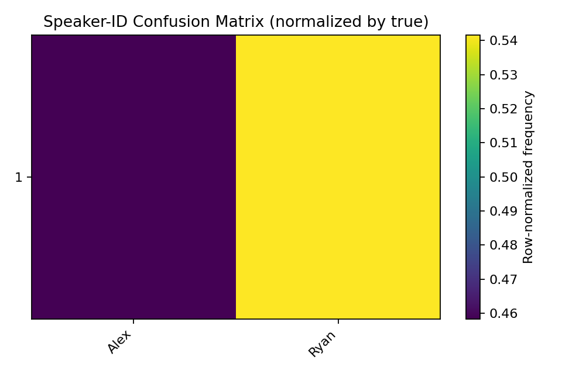
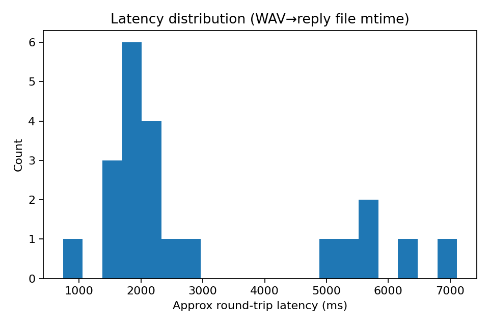

# Evaluation Report
Generated by `scripts/evaluate_corpus.py`.

## Summary
- Utterances: **24**
- With ground-truth labels: **24**
- Speaker-ID accuracy (on labeled subset): **0.0%**
- Unknown/Guest prediction rate: **0.0%**

## Latency (approximate)
- Count: 22
- Mean: 2967.1 ms; Median: 2022.9 ms; P90: 6228.6 ms
- Min: 739.0 ms; Max: 7112.1 ms

## Stability (distinct predicted labels per true speaker)
- 1: 2

## Confusion Matrix

## Latency Histogram

## Notes
- Latency is approximated from file modified times (WAV vs reply file). Use as a rough indicator, not exact.
- Accuracy is computed only on rows where you filled `true_label`.
- `Unknown` includes predictions like `Guest-N` or literal `Unknown`.
